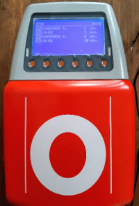
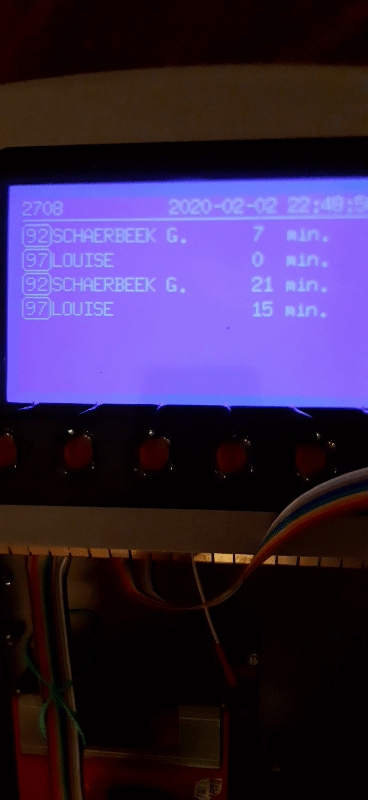

# Upcycled STIB Validator

1. [The Challenge](#the_challenge)
1. [Big Picture](#big_picture)
1. [Realization](#realization)
1. [Hardware Note](#hardware_note)
1. [Schematic](#schematic)
1. [PCB](#pcb)

## The Challenge

The initial challenge was to reuse a decommissioned STIB validator and turn it into something _useful_.



## Big Picture

Most mornings, when I arrive near the tram stop on my way to work, I have to run (uphill) so I don't miss the tram.

If I had left home in time, 2 or 3 minutes earlier, I wouldn't have had to run.

Without having to look at my phone every 2 minutes, I wanted to know when to leave the house to make sure I wouldn't miss the tram or have to run. So the idea was simply to know when the trams would arrive at the stop.

What could be more elegant than a validator to inform me of the tram's arrival in real time!



## Realization

This is a work in progress, it will most certainly never be finished.

The information is given as an inspiration and does not pretend to give any functional result.

Some of the information may be incorrect or obsolete.

>I do it for fun, for the challenge and to keep learning...


### List of Features

Here's what I would like the machine to do.
Not all the features have been achieved yet.

- Retrieve data in real time from the [STIB API](https://www.stib-mivb.be/irj/go/km/docs/resource/OpenData/e5ccae47-7a5d-4768-9c97-5d7618a9ff8b.pdf).
- Display useful information in a not too ugly way.
- Automatic sleep mode.
- Using the validator's keyboard to wake up, switch screens, etc
- Minimum consumption.
- List the stops that are close to the wifi connection point.
- Buzz when we have to leave home to be in time.
- ...

## Hardware Notes

### microcontroller

As a microcontroller, I used the one I had left: [NodeMCU-32S](https://docs.ai-thinker.com/_media/esp32/docs/nodemcu-32s_product_specification.pdf)

The board embeds an [ESP-WROOM-32 from Espressif](https://www.espressif.com/sites/default/files/documentation/esp32-wroom-32_datasheet_en.pdf)

[Some more information about used µController board](https://github.com/nodemcu)

### Screen

- Dimension: `240x128`
- Product ref: `RG240128B-BIW-V`
- LCD
- STN Negative
- blue
- LED
- PIN: 20
- ROHS
- Manufacturer: **RAYSTAR OPTRONICS**

[RG240128B-BIW-V product's Details](assets/RG240128B-BIW-V.pdf)

#### RA6963 Controller Screen pin description

| pin  |           | notes                                    |
| :--: | :-------: | :--------------------------------------- |
|  1   |    VSS    | Ground (0V)                              |
|  2   |    VDD    | Logic Supply Voltage (+3V)               |
|  3   |    VO     | Contrast Adjustment                      |
|  4   |    C/D    | if /WR == L                              |
|      |           | set C/D to H for Command Write           |
|      |           | set C/D to L for Data Write              |
|      |           | if /RD == L                              |
|      |           | set C/D to H for Status Read             |
|      |           | set C/D to L for Data Read               |
|  5   |    /RD    | Read data when RD = L                    |
|  6   |    /WR    | Write data when WR = L                   |
| 7~14 | DB0 - DB7 | Data Bus Line                            |
|  15  |    /CE    | Chip Enable                              |
|  16  |   /RES    | Reset: H = Normal, L = Initialize RA6963 |
|  17  |    VEE    | Negative Power Supply (-20V)             |
|  18  |    MD2    | H:32 columns; L:40 columns               |
|  19  |    FS1    | FS : Pin for selection of font           |
|      |           | H = Font 6×8 (default)                  |
|      |           | L = Font 8×8                            |
|  20  |    NC     | no connection                            |

| pin |      | notes                                 |
| :-: | :--: | :------------------------------------ |
| 19  | LEDA | LED back-light Power Supply + (4.05V) |
| 20  | LEDK | LED back-light Power Supply - (4.05V) |

#### ESP-32S to RA6963 wiring

| ESP-32S GPIO | ESP-32S Board pin | RA6963 raw pin | RA6963 logic | U8glib |
| :----------- | :---------------- | :------------- | :----------- | :----- |
| -            | -                 | 1              | VSS          | -      |
| -            | -                 | 2              | VDD          | -      |
| -            | -                 | 3              | VO           | -      |
| 17           | 28                | 4              | C/D          | dc     |
| -            | -                 | 5              | /RD          | -      |
| 16           | 27                | 6              | /WR          | enable |
| 32           | 13                | 7              | DB0          | d0     |
| 33           | 12                | 8              | DB1          | d1     |
| 25           | 11                | 9              | DB2          | d2     |
| 26           | 10                | 10             | DB3          | d3     |
| 27           | 9                 | 11             | DB4          | d4     |
| 14           | 8                 | 12             | DB5          | d5     |
| 12           | 7                 | 13             | DB6          | d6     |
| 13           | 5                 | 14             | DB7          | d7     |
| 4            | 26                | 15             | /CE          | cs     |
| 15           | 23                | 16             | /RES         | reset  |
| -            | -                 | 17             | VEE          | -      |
| -            | -                 | 18             | MD2          | -      |
| -            | -                 | 19             | FS1          | -      |
| -            | -                 | 20             | NC           | -      |

| ESP-32S GPIO | ESP-32S Board pin | RA6963 raw pin | RA6963 logic | U8glib |
| :----------- | :---------------- | :------------- | :----------- | :----- |
| 2            | 24                | -              | LEDA         | -      |
| -            | -                 | -              | LEDK         | -      |

#### U8g2 Library

RG240128B is just a standard `R6963` GLCD.

U8g2 library works with this display.

[U8g2 & RA6963](https://github.com/olikraus/u8g2/issues/197)

[u8g2: U8glib library for monochrome displays, version 2](https://github.com/olikraus/u8g2)

[U8g2 library wiki](https://github.com/olikraus/u8g2/wiki)

#### C++ setup & wiring

- RA6963 is a `t6963` controler type.
- Display is `240x64`
- 8-bit parallel interface using the 8080 protocol

1. Page buffer
    Use 240 bytes of RAM

    ```C++
    U8G2_T6963_240X64_1_8080(rotation, d0, d1, d2, d3, d4, d5, d6, d7, enable, cs, dc [,reset])
    ```

    Only one page of the display memory is stored in the microcontroller RAM.
    Use a `firstPage()`/`nextPage()` loop for drawing on the display.

1. Page buffer

    Use 480 bytes of RAM
    
    ```C++
    U8G2_T6963_240X64_2_8080(rotation, d0, d1, d2, d3, d4, d5, d6, d7, enable, cs, dc [,reset])
    ```
    
    Same as `1`, but maintains two pages in the microcontroller RAM.
    This will be up to two times faster than `1`.

1. full framebuffer

    Use 1920 bytes of RAM
    
    ```C++
    U8G2_T6963_240X64_F_8080(rotation, d0, d1, d2, d3, d4, d5, d6, d7, enable, cs, dc [,reset])
    ```
    
    Keep a copy of the full display frame buffer in the microcontroller RAM.
    Use `clearBuffer()` to clear the RAM and `sendBuffer()` to transfer the     microcontroller RAM to the display.
    
    The full buffer F option can be used only if there is sufficient RAM available in the     microcontroller.
    
    Use option 1 or 2 on a microcontroller with a small amount of RAM.
    The u8x8 API can be used if there is not even RAM for one page.

#### Rotation

| Rotation/Mirror | Description                                                  |
| --------------: | :----------------------------------------------------------- |
|         U8G2_R0 | No rotation, landscape                                       |
|         U8G2_R1 | 90 degree clockwise rotation                                 |
|         U8G2_R2 | 180 degree clockwise rotation                                |
|         U8G2_R3 | 270 degree clockwise rotation                                |
|     U8G2_MIRROR | No rotation, landscape, display content is mirrored (v2.6.x) |

#### physical bus selection

>Graphics information has to be sent to the display.
This information is received by the display controller through a physical bus (data lines), a communication protocol and a command sequence.

>Often a display supports more than one physical bus. You have to select and setup the correct bus.

>The physical bus is selected by connecting special pins to GND (Low) or +5V (High), often labeled as BS0, BS1 and BS2.

>Read the datasheet of the display controller or the manual for instruction on how to setup a specific bus.

>Sometimes the bus is just fixed and can not be changed.

##### Digital Line

>The display must be connected to the board in order to transfer data from the board to the display.

>Depending on the selected physical bus, several pins have to be connected to the outputs of the board.

>In general, U8g2 can use any outputs of the board. So it does not matter which output pin is used (However it might be clever to select specific pins for hardware accelerated bus communication).

#### Voltage

ESP32 logic is `3.3V`

RA6963 logic is `3.3v` or `5V`

So it can be used without _Level shifter_

#### Power Save Mode

Test of the power save mode from U8G2 is OK

cf. StibESP32/test_powerOff/test_powerOff.ino

#### Notes

- Connect `FS` to `GND` for U8glib, font select 8x8.
- Also note that you need a `10K` variable pot with wiper at `V0`, one end at `GND` or `VSS` other end at `-20V`.
  Adjust the varpot so that `V0` has around `-12V` to `-15V`.

![alt text][tension_negative]

[tension_negative]: assets/tension_negative.png "tension negative DC-DC"

- `VCC` = Collector supply Voltage
- `VEE` = Emitter supply
- `VDD` = Drain supply
- `VSS` = Source supply

### Pin use of ESP-32S

| ESP-32S GPIO | ESP-32S Board pin | Usage      | Pin |
| :----------- | :---------------- | :--------- | :-- |
| VIN 3.3      | 19                | VIN 3.3    | -   |
| EN           | 18                | -          | -   |
| 36           | 17                | -          | -   |
| 39           | 16                | -          | -   |
| 34           | 15                | MPR121-IRQ | IRQ |
| 35           | 14                | -          | -   |
| 32           | 13                | RA6963-DB0 | 7   |
| 33           | 12                | RA6963-DB1 | 8   |
| 25           | 11                | RA6963-DB2 | 9   |
| 26           | 10                | RA6963-DB3 | 10  |
| 27           | 9                 | RA6963-DB4 | 11  |
| 14           | 8                 | RA6963-DB5 | 12  |
| 12           | 7                 | RA6963-DB6 | 13  |
| GND          | 6                 | GND        | -   |
| 13           | 5                 | RA6963-DB7 | 14  |
| 9            | 4                 | -          | -   |
| 10           | 3                 | -          | -   |
| 11           | 2                 | -          | -   |
| VIN 5V       | 1                 | -          | -   |

| ESP-32S GPIO | ESP-32S Board pin | Usage      | Pin |
| :----------- | :---------------- | :--------- | :-- |
| 6            | 20                | -          | -   |
| 7            | 21                | -          | -   |
| 8            | 22                | -          | -   |
| 15           | 23                | RA6963/RES | 16  |
| 2            | 24                | BackLight  | -   |
| 0            | 25                | Buzzer     | -   |
| 4            | 26                | RA6963/CE  | 15  |
| 16           | 27                | RA6963/WR  | 6   |
| 17           | 28                | RA6963/CD  | 4   |
| 5            | 29                | µSD/CS     | 2   |
| 18           | 30                | µSD/CLK    | 4   |
| 19           | 31                | µSD/MISO   | 5   |
| GND          | 32                | -          | -   |
| 21           | 33                | MPR121-SDA | SDA |
| 3            | 34                | -          | -   |
| 1            | 35                | -          | -   |
| 22           | 36                | MPR121-SCL | SCL |
| 23           | 37                | µSD/MOSI   | 3   |
| GND          | 38                | -          | -   |

## Schematic

![alt text][schematic]

[schematic]: assets/Schematic_Stib32_SPI.png "Stib32 SPI Schematic"

## PCB

![alt text][pcb]

[pcb]: assets/Stib32_SPI_PCB.png "Stib32 SPI PCB"
